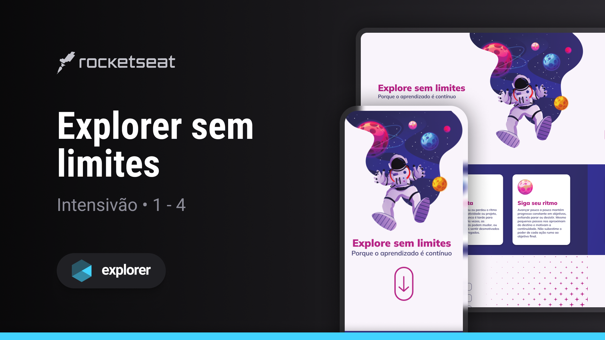
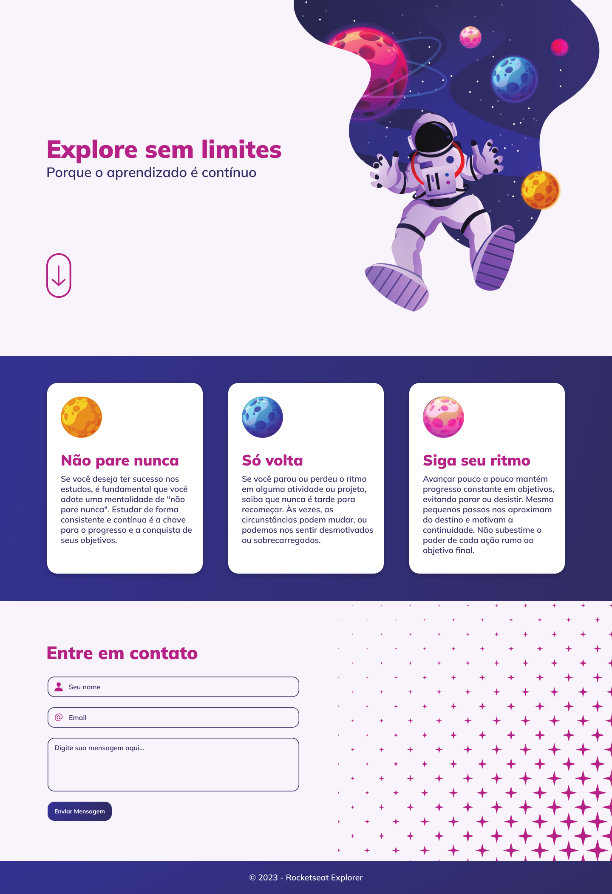
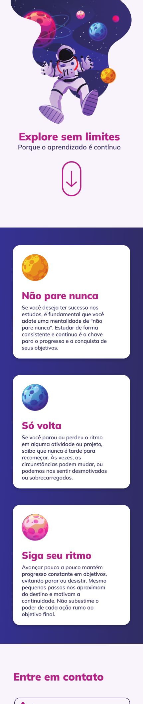

  

   
   

  

    <a href="#-projeto">Projeto</a>&nbsp;&nbsp;&nbsp;|&nbsp;&nbsp;&nbsp;
    <a href="#-tecnologias">Tecnologias</a>&nbsp;&nbsp;&nbsp;|&nbsp;&nbsp;&nbsp;
    <a href="#-layout">Layout</a>&nbsp;&nbsp;&nbsp;|&nbsp;&nbsp;&nbsp;
    <a href="#-contato">Contato</a>
  

  
  

## Sobre o projeto

Este projeto consiste em uma interface web simples, construída como parte da trilha Explorer oferecida pela Rocketseat.
O objetivo principal é Acelerar o processo com um material que resume os níveis 1 a 4. Ideal para quem deseja pegar um atalho na jornada, revisar conteúdo ou desenvolver mais projetos. Nesse projeto, 
foram aplicados os seguintes conceitos:

Conceitos aplicados
* Estruturando projeto de forma semântica
* Aplicar fontes e cores personalizadas no projetos
* Responsividade para diferentes telas de dispositivos
* Posicionar e espaçar os elementos utilizando os conceitos de Box Model e Flexbox.

## Tecnologias
- HTML
- CSS
- Figma

## Layout do projeto
<table>
  <tr>
    <td></td>
    <td></td>
  </tr>   
</table>

## Demonstração
Aqui está uma prévia do resultado final do projeto desenvolvido
[Link Demonstração](https://joao-sillva.github.io/explorer-sem-limites/)

## Contato
Se você tiver alguma dúvida ou quiser entrar em contato, você pode me enviar uma mensagem pelo
[LinkedIn](https://www.linkedin.com/in/joao-sillva/).

(<a href="#readme-top">voltar ao topo</a>)
